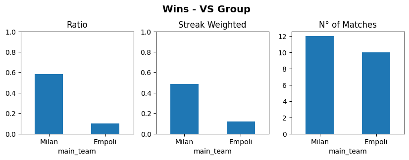
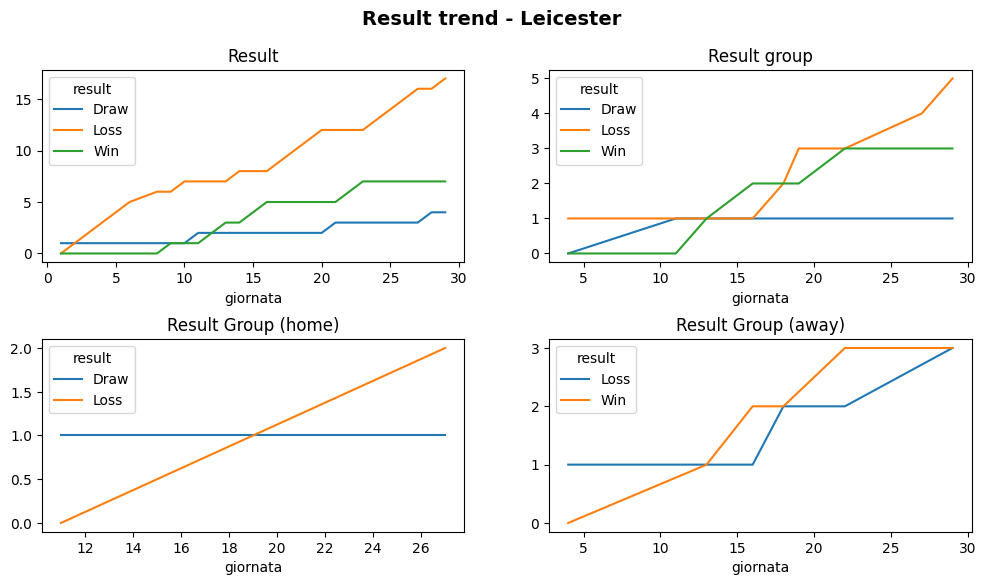
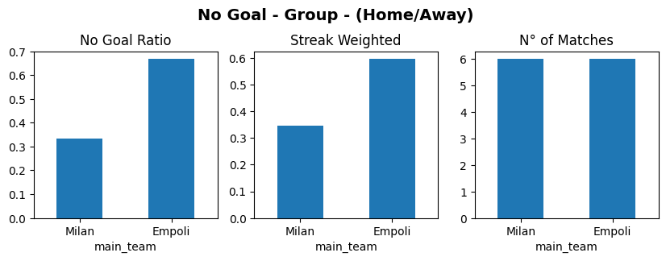

# Football Data Analysis
By leverging historical data from the current season, it is possible to identify trends, recurring results and behaviors for the different teams. We divide the standing into groups and analyze how the various teams perform against that group, both in home and away matches. 

Combining these insights with an intuitive visualization it is possible to use this notebook to have an overview over possible trends, past key metrics to try to predict the outcome of an upcoming match.

##
# How to use the notebook
The magic happpens in this [notebook](Analysis.ipynb). 

The first part of the notebook precalculates metrics for the different dimensions, teams, groups, home/away etc.

Among others:
 - Data is downloaded and stored under [the data raw folder](./data/raw)
 - Data is cleaned and stored under [the data clean folder](./data/clean)
 - Precalculated statistics are computed and stored under [the data outputs folder](./data/outputs)

After these sections comes the interesting analysis for a specific match.

It is enough to change the teams and competion under **Match Analysis** and then execute all cells and get the various metrics.

Just scroll though the code to see intuitive graphs such as these ones.

### Example 1: Wins against teams from the same standing group

### Example 2: Result trends for a specific team

### Example 3: No Goal results against teams from the same standing group (home or away)



## Technicalities
### Env file
It is also necessary to create a .env file with a token to query the [api.football-data.org](https://www.football-data.org/) APIs.

The file is a simple text file to be places in the root folder of the project with this structure:
```
footaball_data_token=<token>
season=<current season>
```

## Pratical Steps to Run the Project

To run the project locally is it simple to use Docker. Create a container to host the jupyter notebook app and spin it up.

#### Create working container to run jupyter
```
docker build -t pypipenv39 .
```
#### Execute container to run jupyter
```
docker run -p 8888:8888 -v $(pwd):/workdir pypipenv39
```

